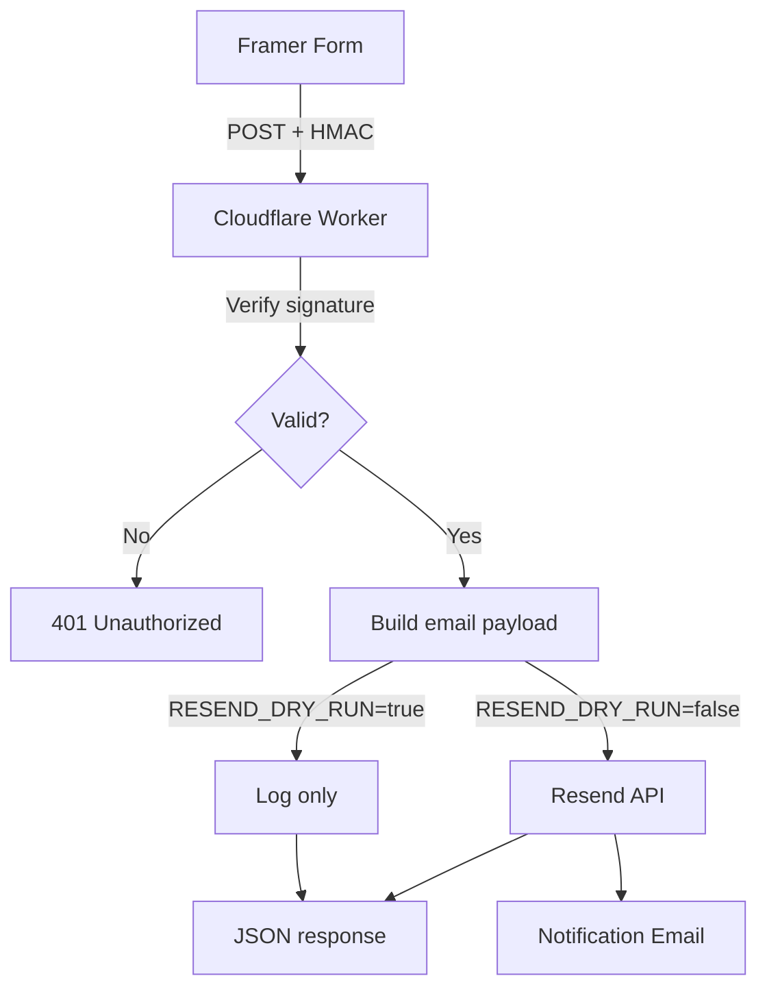

# Resend Webhook Worker

Cloudflare Worker that accepts Framer form webhooks, verifies their HMAC signature, and optionally relays a notification email via Resend.

- **Security**: Every request must include `framer-signature` and `framer-webhook-submission-id`. The Worker recomputes the HMAC using `WEBHOOK_SECRET` before touching the payload.
- **Notifications**: When not in dry-run mode, the Worker POSTs a summary email to Resend using `RESEND_API_KEY`.
- **Config**: Provide `WEBHOOK_SECRET`, `RESEND_API_KEY`, `CUSTOMER_FROM_EMAIL`, `OWNER_EMAIL`, and optional Sheets + rate limit variables via Wrangler secrets/vars or `.dev.vars` for local dev.
- **Local testing**: Run `npm run webhook:test` (reads secrets from `.dev.vars`) to replay a signed webhook against the worker while running `wrangler dev`.
- **Verbose diagnostics**: Set `VERBOSE_LOGGING=true` in `.dev.vars` or as a secret to expose detailed request, signature, and Resend call logs.
- **Project plan**: See `docs/PRD.md` for layered architecture, Google Sheets integration requirements, and phase roadmap.
- **Google Sheets setup**: Follow `docs/GOOGLE_SHEETS_SETUP.md` to create a service account, share your sheets, and load the credentials secret.

## Quick Start

1. `npm install`
2. Copy `.dev.vars.example` to `.dev.vars` and fill in secrets.
3. `npm run dev` to run locally (`RESEND_DRY_RUN` can stay `true`).
4. Deploy with `wrangler deploy` once Framer + Resend secrets are set.

More detail lives in [`docs/README.md`](docs/README.md).

## Testing

Vitest covers the signature verification helper. Run `npm test` after installing dependencies to confirm behaviour.
