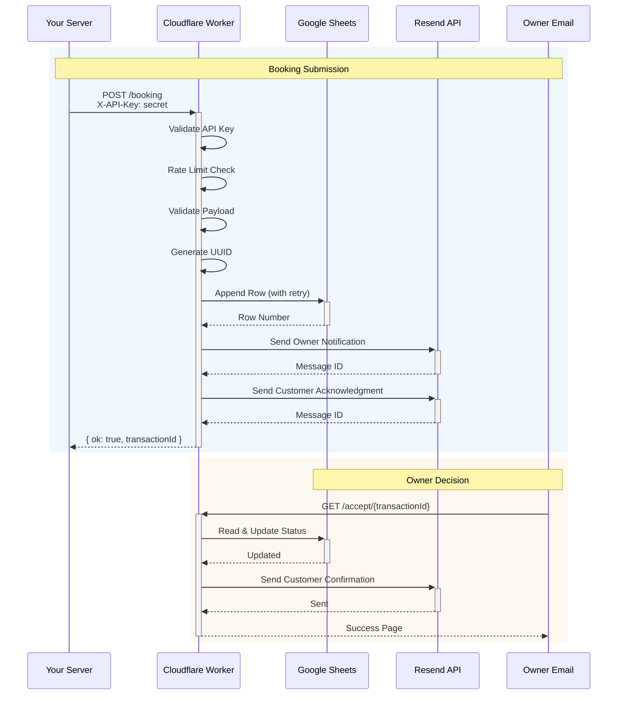

# AC Shuttles Booking Worker

**Enterprise-grade Cloudflare Worker** for shuttle booking management with Google Sheets integration, email notifications, and owner decision workflow.

## Architecture



## Features

- **API Key Authentication** - Server-to-server security with timing-safe comparison
- **Native Rate Limiting** - Cloudflare's built-in rate limiter (no KV needed)
- **Google Sheets Integration** - Retry logic, write verification, audit trail
- **Email Notifications** - Professional templates via Resend
- **Accept/Deny Workflow** - One-click decision links for owner

## API Endpoints

| Method | Path | Description |
|--------|------|-------------|
| `POST` | `/` or `/booking` | Create new booking |
| `GET` | `/accept/{transactionId}` | Accept booking (owner) |
| `GET` | `/deny/{transactionId}` | Deny booking (owner) |
| `GET` | `/health` | Health check |

## Quick Start

### 1. Install Dependencies

```bash
npm install
```

### 2. Configure Environment

Copy `.dev.vars.example` to `.dev.vars`:

```bash
cp .dev.vars.example .dev.vars
```

Fill in your secrets:
- `API_KEY` - Generate with `openssl rand -base64 32`
- `RESEND_API_KEY` - From [resend.com](https://resend.com)
- `GOOGLE_SERVICE_ACCOUNT` - Service account JSON

### 3. Local Development

```bash
npm run dev
```

### 4. Deploy

```bash
# Upload secrets (one-time)
wrangler secret put API_KEY
wrangler secret put RESEND_API_KEY
wrangler secret put GOOGLE_SERVICE_ACCOUNT

# Deploy
wrangler deploy
```

## Request Format

```bash
curl -X POST https://your-worker.workers.dev/booking \
  -H "Content-Type: application/json" \
  -H "X-API-Key: your-api-key" \
  -d '{
    "customer_name": "John Doe",
    "customer_email": "john@example.com",
    "customer_phone": "+1-555-123-4567",
    "start_location": "123 Main St, Atlanta, GA",
    "end_location": "Hartsfield-Jackson Airport",
    "pickup_datetime": "2025-01-15T14:30:00-05:00",
    "passengers": 2,
    "estimated_distance": "25.5 km",
    "estimated_duration": "35 mins",
    "notes": "Early morning flight"
  }'
```

## Response

```json
{
  "ok": true,
  "transactionId": "550e8400-e29b-41d4-a716-446655440000",
  "dryRun": false,
  "receivedAt": "2025-01-10T10:30:00.000Z"
}
```

## Project Structure

```
src/
├── index.ts                 # Main router & email functions
├── layers/
│   ├── security/           # API key auth, rate limiting, validation
│   └── coordination/       # Google Sheets operations
├── integrations/
│   └── googleSheets.ts     # Sheets client with retry logic
└── templates/
    └── emails/             # Email templates

tests/
├── unit/                   # Unit tests
└── integration/            # Integration tests

docs/
└── GOOGLE_SHEETS_SETUP.md  # Sheets integration guide
```

## Environment Variables

### Secrets (via `wrangler secret put`)

| Name | Description |
|------|-------------|
| `API_KEY` | Server authentication key |
| `RESEND_API_KEY` | Resend email API key |
| `GOOGLE_SERVICE_ACCOUNT` | Google service account JSON |

### Variables (in `wrangler.toml`)

| Name | Description |
|------|-------------|
| `WORKER_URL` | Worker URL for email links |
| `OWNER_EMAIL` | Owner notification recipient |
| `CUSTOMER_FROM_EMAIL` | Email sender address |
| `GOOGLE_SHEET_ID_PRIMARY` | Primary sheet ID |
| `GOOGLE_SHEET_ID_BACKUP` | Backup sheet ID |
| `GOOGLE_SHEET_ID_AUDIT` | Audit log sheet ID |

## Testing

```bash
npm test
```

## Deployment Commands

```bash
wrangler deploy           # Deploy to Cloudflare
wrangler tail             # View live logs
wrangler deployments list # List deployments
wrangler rollback         # Rollback to previous
```

## License

Private - AC Shuttles
