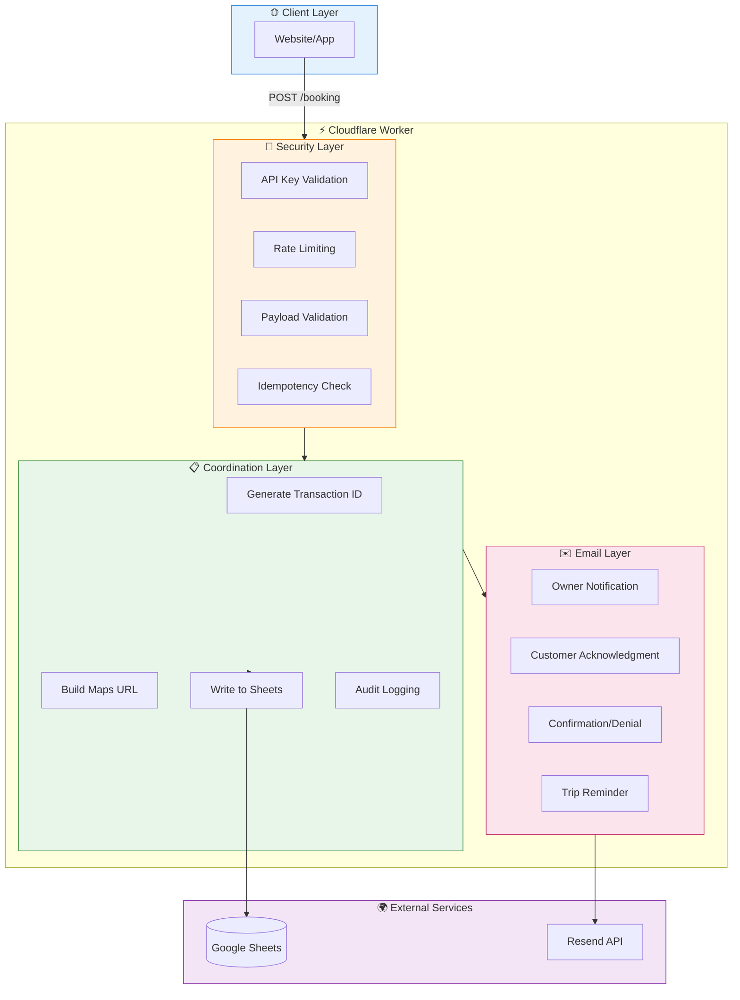
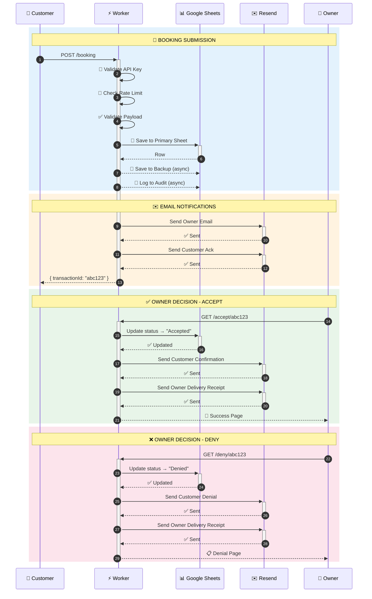

<div align="center">

# 🚐 AC Shuttles Booking Worker

### Enterprise-Grade Cloudflare Worker for Shuttle Booking Management

[](https://workers.cloudflare.com/)
[](https://www.typescriptlang.org/)
[](https://developers.google.com/sheets/api)
[](https://resend.com/)

**Server-side booking system with Google Sheets persistence, professional email notifications, and owner accept/deny workflow.**

[Features](#-features) • [Architecture](#-architecture) • [Quick Start](#-quick-start) • [API Reference](#-api-reference) • [Email Templates](#-email-templates)

</div>

---

## 📋 Table of Contents

- [Features](#-features)
- [Architecture](#-architecture)
- [Complete Booking Flow](#-complete-booking-flow)
- [Quick Start](#-quick-start)
- [API Reference](#-api-reference)
- [Email Templates](#-email-templates)
- [Configuration](#-configuration)
- [Testing](#-testing)
- [Deployment](#-deployment)

---

## ✨ Features

<table>
<tr>
<td width="50%">

### 🔐 Security
- **API Key Authentication** with timing-safe comparison
- **Native Cloudflare Rate Limiting** (10 req/min)
- **Input Validation** with detailed error messages
- **Formula Injection Prevention** in Google Sheets

</td>
<td width="50%">

### 📊 Data Persistence
- **Google Sheets Integration** with automatic retry
- **Write Verification** (read-after-write confirmation)
- **Primary + Backup Sheets** for redundancy
- **Audit Trail** for all operations

</td>
</tr>
<tr>
<td width="50%">

### ✉️ Email Notifications
- **6 Professional Email Templates** with dark mode
- **Owner Notifications** with Accept/Deny buttons
- **Customer Journey Emails** (ack, confirm, deny, remind)
- **Anti-spam Compliant** (CAN-SPAM headers)

</td>
<td width="50%">

### ⚡ Performance
- **Edge Computing** via Cloudflare Workers
- **Exponential Backoff** retry logic
- **Async Fire-and-Forget** for non-critical writes
- **Token Caching** for Google OAuth

</td>
</tr>
</table>

---

## 🏗 Architecture

```
┌─────────────────────────────────────────────────────────────────────────────┐
│                           AC SHUTTLES BOOKING SYSTEM                        │
└─────────────────────────────────────────────────────────────────────────────┘

┌──────────────┐     ┌──────────────────┐     ┌──────────────────────────────┐
│   Frontend   │────▶│  Cloudflare      │────▶│      External Services       │
│   Website    │     │  Worker          │     │                              │
└──────────────┘     └──────────────────┘     │  ┌────────────────────────┐  │
                            │                 │  │   📊 Google Sheets     │  │
                            │                 │  │   • Primary Sheet      │  │
                            ▼                 │  │   • Backup Sheet       │  │
                     ┌──────────────┐         │  │   • Audit Log          │  │
                     │   Layers     │         │  └────────────────────────┘  │
                     │              │         │                              │
                     │  🔐 Security │         │  ┌────────────────────────┐  │
                     │  📋 Coordination│      │  │   ✉️ Resend Email      │  │
                     │  ✉️ Email    │         │  │   • Owner notifications│  │
                     └──────────────┘         │  │   • Customer emails    │  │
                                              │  └────────────────────────┘  │
                                              └──────────────────────────────┘
```

### Layer Architecture



---

## 🔄 Complete Booking Flow



---

## 🚀 Quick Start

### Prerequisites

- [Node.js](https://nodejs.org/) 18+
- [Wrangler CLI](https://developers.cloudflare.com/workers/wrangler/install-and-update/)
- Google Cloud Service Account with Sheets API enabled
- [Resend](https://resend.com/) account for email

### Installation

```bash
# Clone the repository
git clone https://github.com/your-org/ac-shuttle-worker.git
cd ac-shuttle-worker

# Install dependencies
npm install

# Configure secrets
wrangler secret put API_KEY
wrangler secret put RESEND_API_KEY
wrangler secret put GOOGLE_SERVICE_ACCOUNT

# Deploy
npm run deploy
```

### Local Development

```bash
# Start local dev server
npm run dev

# Run tests
npm test

# Type check
npm run typecheck
```

---

## 📡 API Reference

### Endpoints Overview

| Method | Endpoint | Description | Auth |
|--------|----------|-------------|------|
| `POST` | `/booking` | Create new booking | API Key |
| `GET` | `/accept/:id` | Accept a booking | None |
| `GET` | `/deny/:id` | Deny a booking | None |
| `GET` | `/health` | Health check | None |

---

### `POST /booking`

Create a new booking request.

**Headers**
```
Content-Type: application/json
X-API-Key: your-secret-api-key
```

**Request Body**
```json
{
  "customer_name": "John Smith",
  "customer_email": "john@example.com",
  "customer_phone": "609-555-0100",
  "start_location": "123 Main St, Philadelphia, PA 19103",
  "end_location": "Newark Liberty International Airport, Newark, NJ",
  "pickup_datetime": "2025-02-20T14:30",
  "passengers": 3,
  "estimated_distance": "95 miles",
  "estimated_duration": "1 hour 45 minutes",
  "notes": "Please call 5 minutes before arrival"
}
```

**Success Response** `200 OK`
```json
{
  "ok": true,
  "transactionId": "550e8400-e29b-41d4-a716-446655440000",
  "dryRun": false,
  "receivedAt": "2025-02-15T10:30:00.000Z"
}
```

**Error Response** `400 Bad Request`
```json
{
  "ok": false,
  "error": "Validation failed",
  "details": {
    "customer_email": "Invalid email format"
  }
}
```

---

### `GET /accept/:transactionId`

Accept a booking request. Sends confirmation email to customer.

**Response**: HTML page confirming acceptance

---

### `GET /deny/:transactionId`

Deny a booking request. Sends denial email to customer.

**Response**: HTML page confirming denial

---

## ✉️ Email Templates

<table>
<tr>
<th>Email Type</th>
<th>Recipient</th>
<th>Trigger</th>
<th>Theme</th>
</tr>
<tr>
<td>📬 <b>Owner Notification</b></td>
<td>Owner</td>
<td>New booking submitted</td>
<td>🟠 Amber (Action Required)</td>
</tr>
<tr>
<td>📝 <b>Customer Acknowledgment</b></td>
<td>Customer</td>
<td>After owner email sent</td>
<td>🔵 Blue (Request Received)</td>
</tr>
<tr>
<td>✅ <b>Customer Confirmation</b></td>
<td>Customer</td>
<td>Owner accepts booking</td>
<td>🟢 Teal (Ride Confirmed)</td>
</tr>
<tr>
<td>❌ <b>Customer Denial</b></td>
<td>Customer</td>
<td>Owner denies booking</td>
<td>🔴 Red (Unable to Accommodate)</td>
</tr>
<tr>
<td>🔔 <b>Customer Reminder</b></td>
<td>Customer</td>
<td>24h before trip or immediately if &lt;24h</td>
<td>🟢 Teal (Trip Reminder)</td>
</tr>
<tr>
<td>📨 <b>Owner Delivery</b></td>
<td>Owner</td>
<td>After customer notification sent</td>
<td>⚪ Gray (Delivery Confirmation)</td>
</tr>
</table>

### Generate Previews

```bash
npm run generate:previews
open email-previews/
```

### Email Features
- ✅ **Dark Mode Support** via CSS media queries
- ✅ **Mobile Responsive** design
- ✅ **Anti-spam Compliant** with CAN-SPAM headers
- ✅ **Embedded Logos** (no external image dependencies)
- ✅ **Ticket-style Design** with airport codes

---

## ⚙️ Configuration

### Environment Variables

Configure in `wrangler.toml`:

```toml
[vars]
# Worker URL
WORKER_URL = "https://ac-shuttle-worker.example.workers.dev"

# Email Configuration
CUSTOMER_FROM_EMAIL = "contact@acshuttles.com"
OWNER_EMAIL = "owner@acshuttles.com"

# Driver Info (shown to customers)
DRIVER_CONTACT_NAME = "Mike Johnson"
DRIVER_CONTACT_EMAIL = "driver@acshuttles.com"
DRIVER_CONTACT_PHONE = "609-555-0199"

# Google Sheets
GOOGLE_SHEET_ID_PRIMARY = "your-primary-sheet-id"
GOOGLE_SHEET_ID_BACKUP = "your-backup-sheet-id"
GOOGLE_SHEET_ID_AUDIT = "your-audit-sheet-id"

# Reliability Settings
SHEETS_MAX_RETRIES = "3"
SHEETS_RETRY_DELAY_MS = "1000"
SHEETS_VERIFY_WRITES = "true"

# Feature Flags
RESEND_DRY_RUN = "false"
VERBOSE_LOGGING = "true"
```

### Secrets

Set via Wrangler CLI:

```bash
wrangler secret put API_KEY
wrangler secret put RESEND_API_KEY
wrangler secret put GOOGLE_SERVICE_ACCOUNT
```

---

## 🧪 Testing

### Test Commands

```bash
# Run all tests (watch mode)
npm test

# Run once
npm run test:run

# Run by category
npm run test:unit
npm run test:integration
npm run test:e2e

# With coverage
npm run test:coverage
```

### Test Coverage

| Category | Tests | Coverage |
|----------|-------|----------|
| Unit Tests | Google Sheets, Email Templates | ✅ |
| Integration Tests | Full workflow, Security, Routing | 56 tests |
| E2E Tests | Real API with email validation | Optional |

### E2E Testing with Real Emails

```bash
E2E_WORKER_URL=https://your-worker.workers.dev \
E2E_API_KEY=your-api-key \
E2E_TEST_EMAIL=test@mailinator.com \
npm run test:e2e
```

---

## 🚢 Deployment

### Deploy to Cloudflare

```bash
# Production deployment
npm run deploy

# View logs
npm run logs
```

### Google Sheets Setup

1. Create a Google Cloud project
2. Enable Google Sheets API
3. Create a service account
4. Download JSON credentials
5. Share your sheets with the service account email
6. Set the `GOOGLE_SERVICE_ACCOUNT` secret with the JSON content

### Sheet Column Structure

| Col | Field | Description |
|-----|-------|-------------|
| A | Transaction ID | UUID v4 |
| B | Idempotency Key | Dedup key |
| C | Submitted At | ISO timestamp |
| D | Customer Name | Full name |
| E | Customer Email | Lowercase |
| F | Customer Phone | Optional |
| G | Start Location | Pickup address |
| H | End Location | Dropoff address |
| I | Pickup DateTime | ISO format |
| J | Est. Distance | e.g., "95 miles" |
| K | Est. Duration | e.g., "1h 45m" |
| L | Passengers | Number |
| M | Notes | Optional |
| N-P | Driver Info | Name, Email, Phone |
| Q | Status | Pending/Accepted/Denied |
| R | Google Maps URL | Directions link |
| S | Raw Payload | JSON backup |

---

## 📁 Project Structure

```
ac-shuttle-main-worker/
├── src/
│   ├── index.ts                 # Main worker entry point
│   ├── layers/
│   │   ├── security/            # API key, rate limiting, validation
│   │   └── coordination/        # Google Sheets operations
│   ├── integrations/
│   │   └── googleSheets.ts      # Sheets client with retry logic
│   └── templates/
│       └── emails/              # Email template generators
│           ├── ownerNotification.ts
│           ├── customerSubmissionAck.ts
│           ├── customerConfirmation.ts
│           ├── customerDenial.ts
│           ├── customerReminder.ts
│           ├── ownerDeliveryNotification.ts
│           └── utils.ts         # Shared email utilities
├── tests/
│   ├── unit/                    # Unit tests
│   ├── integration/             # Integration tests
│   ├── e2e/                     # End-to-end tests
│   └── helpers/                 # Test utilities
├── scripts/
│   └── generate-email-previews.ts
├── email-previews/              # Generated HTML previews
├── wrangler.toml                # Cloudflare config
└── package.json
```

---

## 🔒 Security Features

| Feature | Implementation |
|---------|----------------|
| **API Key Auth** | Timing-safe comparison prevents timing attacks |
| **Rate Limiting** | Native Cloudflare rate limiter (10/min per API key) |
| **Input Validation** | Strict validation of all fields with detailed errors |
| **XSS Prevention** | HTML escaping in all email templates |
| **Formula Injection** | Cell prefixing prevents spreadsheet injection |
| **CSRF Protection** | POST-only booking endpoint with API key |

---

## 📝 License

MIT License - see [LICENSE](LICENSE) for details.

---

<div align="center">

**Built with ❤️ for AC Shuttles**

[Report Bug](https://github.com/your-org/ac-shuttle-worker/issues) • [Request Feature](https://github.com/your-org/ac-shuttle-worker/issues)

</div>
