# AC Shuttles Booking System 🚗

**Production-ready Cloudflare Worker** that processes Framer form submissions into a complete booking workflow with secure decision handling, Google Sheets integration, and professional email notifications.

```mermaid
graph TD
  A[Framer Form] -->|Webhook + HMAC| B[Security Layer]
  B -->|Valid| C[Coordination Layer]
  B -->|Invalid| D[🚫 401/429 Error]
  
  C -->|Generate Transaction ID| E[Google Sheets]
  E -->|Primary + Backup| F[Audit Trail]
  
  C -->|Build Email| G[Owner Notification]
  G -->|Secure Tokens| H[📧 Professional Email]
  H -->|Accept Link| I[✅ Accept Decision]  
  H -->|Deny Link| J[❌ Deny Decision]
  
  I -->|Update Status| K[Google Sheets Update]
  J -->|Update Status| K
  K -->|Customer Notification| L[📧 Confirmation Email]
  
  I -->|Success Page| M[✅ Confirmation]
  J -->|Success Page| N[❌ Confirmation]
```

## 🎯 **Current Status: Production Ready** ✅

**Version 2.0.0** - Complete booking system with all major features implemented:

### ✅ **Core Features**
- **🔐 Security**: HMAC verification, rate limiting, one-time secure tokens (SHA-256)
- **📊 Data Management**: Google Sheets CRUD with primary/backup/audit trail
- **📧 Professional Emails**: Information-first design, print-compatible, mobile-responsive
- **🎯 Decision Workflow**: Secure accept/deny system with status validation
- **📱 Multi-Platform**: Works perfectly in Gmail, Outlook, Apple Mail, and print
- **🔄 Comprehensive Logging**: Structured JSON logs with full audit trail

### ✅ **Major Enhancements Completed**
- **One-time secure tokens**: SHA-256 hashed tokens prevent replay attacks
- **Google Sheets integration**: Full read/write/update operations with audit trail  
- **Status-based validation**: Links remain valid until booking status changes
- **Professional email design**: Information hierarchy with price/route prominence
- **Print compatibility**: CSS ensures proper rendering when printed
- **Optional field support**: Handles forms with/without pricing, vehicle types, notes
- **Decision protection**: Prevents multiple decisions with clear error pages

### ✅ **Architecture Overview**
- **Security Layer**: HMAC verification, rate limiting, duplicate prevention
- **Coordination Layer**: Google Sheets CRUD, transaction IDs, audit trail  
- **Messaging Layer**: Professional email templates with mobile/print compatibility
- **Decision System**: Secure token-based workflow with status validation

## Quick Start

1. `npm install`
2. Copy `.dev.vars.example` to `.dev.vars` and fill in secrets.
3. `npm run dev` to run locally (`RESEND_DRY_RUN` can stay `true`).
4. Deploy with `wrangler deploy` once Framer + Resend secrets are set.

More detail lives in [`docs/README.md`](docs/README.md).

## Testing

Vitest covers the signature verification helper. Run `npm test` after installing dependencies to confirm behaviour.
