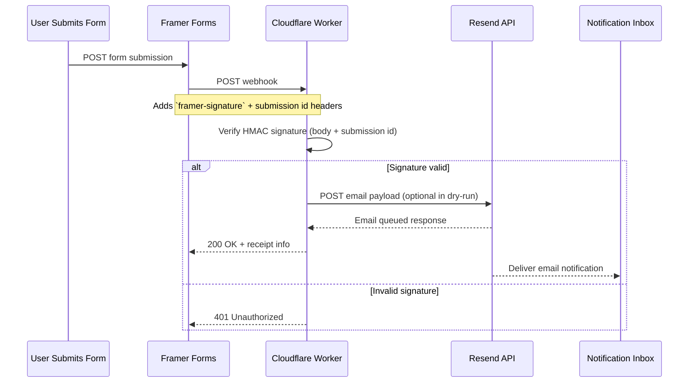
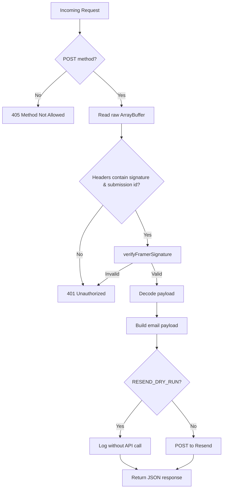

# Resend Webhook Worker

This document captures the security model, runtime flow, and local testing strategy for the Cloudflare Worker that accepts Framer form webhooks and relays notifications through Resend.

## High-Level Flow



## Security Responsibilities

- **HMAC enforcement** – Every request must carry Framer’s `framer-signature` and `framer-webhook-submission-id` headers. The Worker recomputes the HMAC using `WEBHOOK_SECRET` before processing any payload (`verifyFramerSignature`).
- **Secret storage** – `WEBHOOK_SECRET`, `RESEND_API_KEY`, and email addresses live in Wrangler secrets/vars or `.dev.vars`. No secrets are committed to the repository.
- **Payload handling** – The Worker decodes the body _after_ signature verification, redacts sensitive headers in email metadata, and supports a `RESEND_DRY_RUN` flag for safe local tests.



## Local Testing

1. Copy `.dev.vars.example` to `.dev.vars` and populate `WEBHOOK_SECRET`, `RESEND_API_KEY`, `CUSTOMER_FROM_EMAIL`, `OWNER_EMAIL`, and Google Sheets IDs.
2. Run `npm install` to install dependencies, then `npm run dev` or `wrangler dev --local`.
3. Use the provided helper script to replay signed requests. It auto-loads
   values from `.dev.vars`, so no extra setup is needed after step 1.

```bash
# Runs against http://127.0.0.1:8787/ by default
npm run webhook:test

# Override payload, submission id, or URL if needed
WEBHOOK_URL=http://127.0.0.1:8787/ \
WEBHOOK_PAYLOAD='{"message":"Hello"}' \
SUBMISSION_ID=test-123 \
npm run webhook:test
```

The script mirrors Framer’s signing scheme (`HMAC(secret, body + submissionId)`) and prints the HTTP status/response. Any tampering returns `401`.

## Deployment Checklist

- `wrangler secret put WEBHOOK_SECRET`
- `wrangler secret put RESEND_API_KEY`
- `wrangler kv:namespace create` *(optional, only if future state is needed)*
- `wrangler deploy`
- Update the Framer form webhook URL and shared secret to match.

### Runtime Configuration

| Variable | Purpose |
| --- | --- |
| `WEBHOOK_SECRET` | Shared secret used to compute/verify Framer's HMAC signature |
| `RESEND_API_KEY` | Bearer token for Resend's email API |
| `CUSTOMER_FROM_EMAIL` | Sender used for all outbound emails (owner + customer) |
| `OWNER_EMAIL` | Recipient of the owner alert |
| `RESEND_DRY_RUN` | When `true`, skips the Resend call but still logs payloads |
| `VERBOSE_LOGGING` | When `true`/`1`, emits detailed diagnostic logs |

## Useful Commands

- `npm run dev` – Run worker locally in Miniflare (`--local`).
- `npm run dev:edge` – Tunnel traffic to the Cloudflare edge runtime.
- `npm test` – Execute Vitest unit tests (signature verification, etc.).
- `wrangler tail` – Stream logs from the deployed Worker while you submit forms.

## Failure Modes & Mitigations

- **Invalid signature** – Worker returns `401`; verify Framer secret alignment; ensure signing script uses raw bytes.
- **Resend errors** – Worker throws after logging status + response text; check credentials and sender domain.
  The worker now responds with `502` and a JSON `{ ok: false, error: "Failed to send notification" }` when Resend rejects the call. Inspect Cloudflare logs (enable `VERBOSE_LOGGING`) for the exact status/text.
- **Runaway logs** – Observability is enabled but you can disable `[observability]` blocks if needed.

## Future Enhancements

- Persist incoming payloads to a KV/Durable Object for audit trails.
- Support multiple Framer secrets or rotate keys via binding versioning.
- Add rate limiting using Cloudflare Turnstile or secondary headers to prevent abuse.
